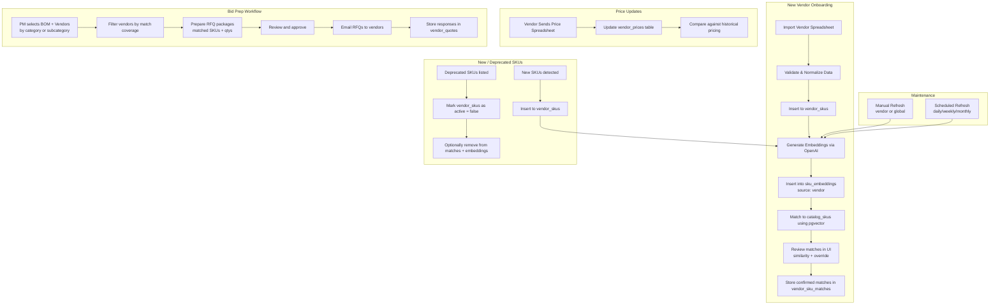

# SKU Onboarding and Bidding Process

```mermaid
flowchart TD

%% New Vendor Flow
subgraph New_Vendor_Onboarding [New Vendor Onboarding]
  A1[Import Vendor Spreadsheet]
  A2[Validate & Normalize Data]
  A3[Insert to vendor_skus]
  A4[Generate Embeddings via OpenAI]
  A5[Insert into sku_embeddings\nsource: vendor]
  A6[Match to catalog_skus using pgvector]
  A7[Review matches in UI\nsimilarity + override]
  A8[Store confirmed matches in vendor_sku_matches]
  A1 --> A2 --> A3 --> A4 --> A5 --> A6 --> A7 --> A8
end

%% Price Update Flow
subgraph Price_Updates [Price Updates]
  B1[Vendor Sends Price Spreadsheet]
  B2[Update vendor_prices table]
  B3[Compare against historical pricing]
  B1 --> B2 --> B3
end

%% New SKUs and Deprecation
subgraph SKU_Changes [New / Deprecated SKUs]
  C1[New SKUs detected] --> C2[Insert to vendor_skus] --> A4
  D1[Deprecated SKUs listed] --> D2[Mark vendor_skus as active = false]
  D2 --> D3[Optionally remove from matches + embeddings]
end

%% Maintenance
subgraph Maintenance
  E1[Manual Refresh\nvendor or global]
  E2[Scheduled Refresh\ndaily/weekly/monthly]
  E1 --> A4
  E2 --> A4
end

%% Bid Workflow
subgraph Bid_Preparation [Bid Prep Workflow]
  F1[PM selects BOM + Vendors\nby category or subcategory]
  F2[Filter vendors by match coverage]
  F3[Prepare RFQ packages\nmatched SKUs + qtys]
  F4[Review and approve]
  F5[Email RFQs to vendors]
  F6[Store responses in vendor_quotes]
  F1 --> F2 --> F3 --> F4 --> F5 --> F6
end
```
